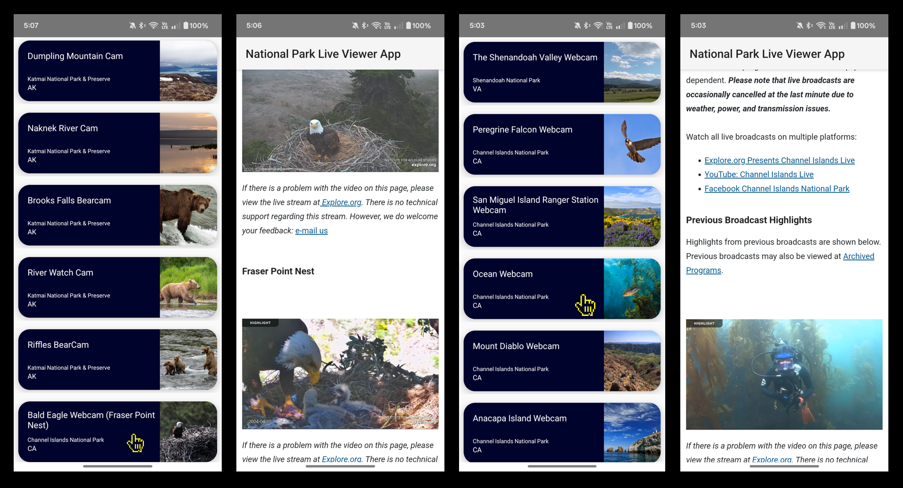

# National Park WebCam Android Project
## Project Overview
The National Park Webcam App allows users to view live webcam feeds from various national parks around America. The app provides an easy-to-use interface where users can browse and explore different national parks and view their current webcam streams.

## Screenshots
- Main Screen: Shows the park list and WebCam footage.
- WebCam View: Displays the real-time camera footage.

## Features
- Display live WebCam footage from different national parks.
- Switch between multiple parks and camera views.
- View detailed information about each national park, including location and park highlights.
- Simple and user-friendly interface for easy navigation.

## Tech Stack
- Development Environment: Android Studio
- Programming Language: Kotlin
- UI Design: XML layout files and Android UI components
- Network Requests: Retrofit

## Project Structure
<pre>
NationalParkWebcamApp/
├── app/
│   ├── src/
│   │   ├── main/
│   │   │   ├── java/com/example/nationalparkwebcam/
│   │   │   │   ├── ui/                  # UI-related classes (Activities, Fragments)
│   │   │   │   ├── network/             # Network-related classes (API service, Retrofit)
│   │   │   ├── res/                     # Resources (layouts, strings, images, etc.)
│   │   │   │   ├── layout/              # XML layout files
│   │   │   │   ├── values/              # Colors, strings, styles
│   │   │   │   └── drawable/            # Drawables (images)
│   │   │   └── AndroidManifest.xml      # Application manifest
└── build.gradle                         # Project-level build configuration
└── settings.gradle                      # Gradle settings
</pre>

## Steps to Configure the API Key

1. Obtain an API Key:
- To fetch webcam data and park information, you need an API key from the National Park Web service. 
    Follow these steps:
    - Go to [National Park Web Service](https://www.nps.gov/subjects/developer/guides.htm)
    - Register for an account and generate an API key.
    - Copy the API key provided.

2. Add the API Key to the Project:
- Create an api_key.json file in the app/src/main/assets/ directory of the project.
- Add your API key in the file as follows<pre>
{
  "API_KEY": "your_api_key_here"
}
</pre>

3. Configure necessary permissions:
- Open the AndroidManifest.xml file and add permissions for internet access and network state:<pre>
   < uses-permission android:name="android.permission.INTERNET" />
</pre>

## Acknowledgments
- [National Park Web API Documentation](https://www.nps.gov/subjects/developer/api-documentation.htm) - For providing access to national park and webcam data.
- [Android Official Guide](https://developer.android.com/codelabs/basic-android-kotlin-compose-first-app#7): Building Your First App - A comprehensive tutorial for beginners.
- [Android Networking with Retrofit](https://developer.android.com/codelabs/basic-android-kotlin-compose-getting-data-internet#7) - For implementing network calls in the app.
- [Glide Image Loading Library](https://github.com/codepath/android_guides/wiki/Displaying-Images-with-the-Glide-Library) - Used for efficient image loading and caching.
- [RecyclerView Official Documentation](https://developer.android.com/reference/kotlin/androidx/recyclerview/widget/RecyclerView) - For displaying and managing large sets of data in a scrollable list.
- [XML Layouts for Android](https://developer.android.com/develop/ui/views/layout/declaring-layout) - For building UI using XML layout files.